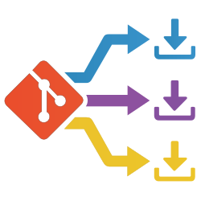
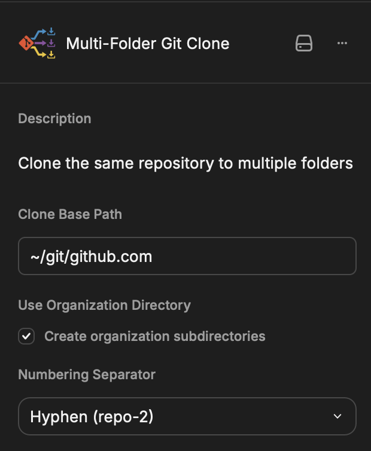
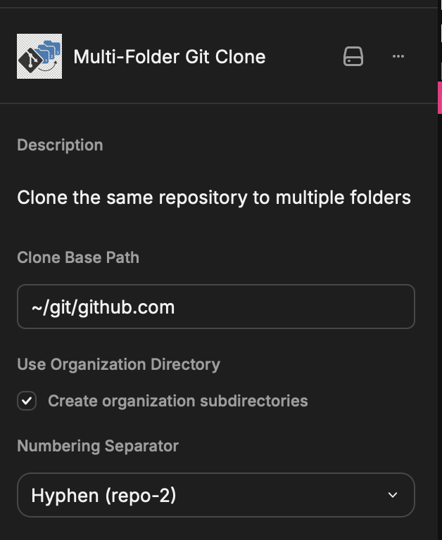
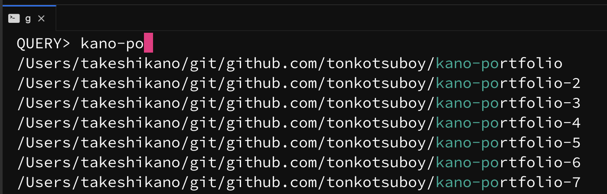
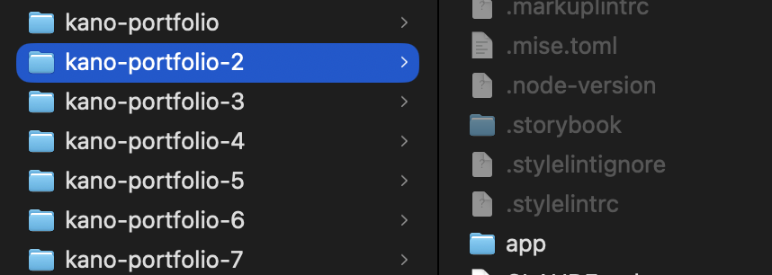

# Multi-Folder Git Clone

<p align="center">
  
</p>

同じリポジトリを、自動で連番を振りながら複数のフォルダに一括でクローンするための Raycast 拡張機能です。

## モチベーション

- **AIエージェント時代への対応**: 一つのリポジトリに対して、並行して複数のAIエージェント（Clineなど）に作業を依頼したい。
- **マルチクローン派**: `git worktree` よりも、完全に独立した複数のクローンを持ちたい。
- **ghqライクな管理**: `org/リポジトリ名` の構造で整然と管理したい。
- **高速な移動**: `peco` などのツールと組み合わせて、`g` キーだけで複数のリポジトリ間を爆速で行き来したい。
- **脱ターミナル**: ターミナルを開くことなく、キーボードショートカットから一瞬でクローンを完了させたい。

そんな欲望を叶えるために作成しました😊

## 特徴

1. **URLとクローン数を指定するだけ**: クローンしたいリポジトリのURLを入力し、クローン数を指定するだけで完了します。
2. **自動採番**: 指定したフォルダに `-2`, `-3` ... と自動で採番してクローンしてくれます。
3. **ghq管理下へのクローン**: クローン先を ghq のパス（例: `~/git/github.com`）に設定すれば、そのまま `peco` などの既存ワークフローに組み込めます。

## 使い方

### 1. リポジトリURLとクローン数を指定
Raycast でコマンドを起動し、URLと必要なクローン数を入力します。



### 2. 指定フォルダに自動採番してクローン
Finderで見ると、このように連番付きのフォルダが自動で作成されています。



### 3. peco 等で爆速移動
`ghq` 管理下にクローンすれば、ターミナルから `g` コマンド（peco連携）などで一瞬で目的のフォルダに移動できます。



## 設定

クローン先のベースパスや、組織名のディレクトリを作成するかどうか、採番時のセパレーター（`-`, `_`, `.`）などをカスタマイズ可能です。



## インストール

```bash
npm install
npm run dev
```
